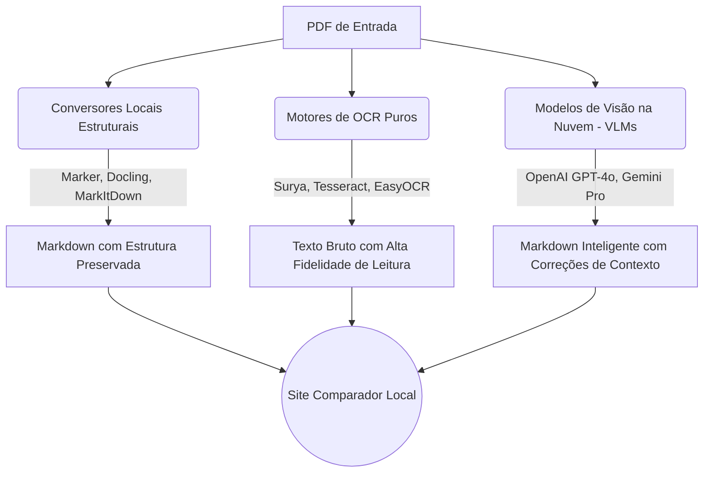

# Comparador Didático: PDF → Markdown & OCR

Bem-vindo ao observatório de **Extração de Texto e Estrutura**! 
Este repositório foi criado para aprender e comparar didaticamente como diferentes ferramentas de Inteligência Artificial e OCR interpretam e convertem arquivos PDF estruturados (com tabelas, títulos e formatações).

## 🛠 Arquitetura do Projeto

Aqui usamos uma abordagem separada para cada "família" de ferramentas:

## 🚀 Como reproduzir localmente?

1. Instale o Python e crie um ambiente virtual: `python3 -m venv venv` e então `source venv/bin/activate`
2. Instale as dependências Python do projeto: `pip install -r requirements.txt`
3. Garanta que os CLIs abaixo estejam disponíveis no `PATH` do terminal que vai rodar o projeto:
   `marker_single`, `mineru`, `surya_ocr`, `tesseract`, `pdftoppm`
4. Carregue as credenciais de nuvem antes de rodar: `source ~/.secrets`
5. Rode `./run.sh` para ativar o `venv` correto e executar o fluxo completo.
6. Se quiser validar o ambiente antes, rode `python3 src/environment_diagnostics.py`.
7. Abra o `docs/index.html` em seu navegador para comparar os resultados gerados de forma visual.

## 🧪 Diagnóstico do runner

O diagnóstico detalhado do problema encontrado no terminal, com plano de correção e visualização do fluxo, está em:

- `docs/diagnostics/2026-03-13-runner-hardening.md`
