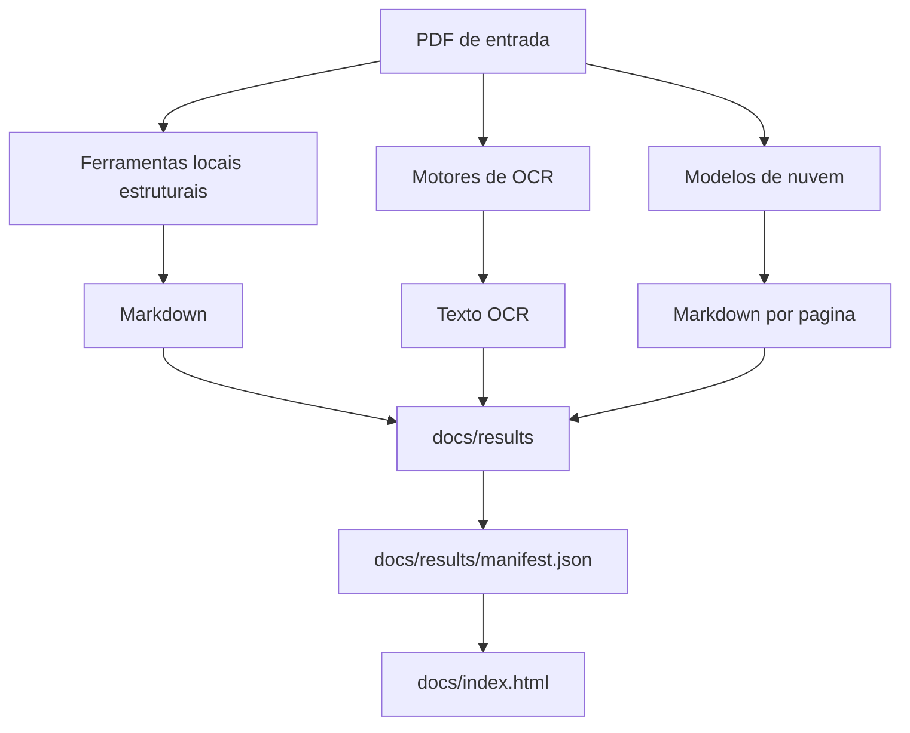

# Comparador de PDF → Markdown e OCR

Este projeto compara como diferentes ferramentas transformam o mesmo PDF em:

- markdown estruturado
- OCR puro
- interpretação visual por modelos de nuvem

## Visão geral



## Ferramentas comparadas

- `marker`
- `mineru`
- `docling`
- `markitdown`
- `surya`
- `tesseract`
- `easyocr`
- `openai`
- `gemini`

## Como rodar tudo

1. Crie e ative o ambiente virtual:

```bash
python3 -m venv venv
source venv/bin/activate
```

2. Instale as dependências:

```bash
pip install -r requirements.txt
```

3. Carregue as chaves:

```bash
source ~/.secrets
```

4. Rode o fluxo completo:

```bash
./run.sh
```

## Como abrir a visualização

```bash
python3 scripts/build_manifest.py
./scripts/serve_docs.sh
```

Depois abra `http://localhost:8000`.

## Testar um PDF qualquer fora deste projeto

### Marker

```bash
source venv/bin/activate
python3 scripts/run_one.py \
  --tool marker \
  --input ~/Downloads/meu-pdf.pdf \
  --output ~/Desktop/pdf-tests
```

### MinerU

```bash
source venv/bin/activate
python3 scripts/run_one.py \
  --tool mineru \
  --input ~/Downloads/meu-pdf.pdf \
  --output ~/Desktop/pdf-tests
```

## Saídas importantes

- `docs/results/...`: resultados gerados
- `docs/results/manifest.json`: mapa real do que foi gerado
- `docs/index.html`: interface visual
- `document.md`: arquivo consolidado para ferramentas que antes geravam só `page_0`, `page_1`, etc.

## Observações práticas

- `Marker` e `MinerU` costumam ser os melhores para preservar figuras e estrutura.
- `Docling` tende a produzir markdown mais limpo.
- `Cloud APIs` e `OCR Engines` agora processam uma página por vez para reduzir uso de memória.
- `MarkItDown` precisa ser instalado com suporte a PDF: `markitdown[pdf]`.
- `Surya` depende do CLI atual `surya_ocr ... --output_dir ...`.

## Documentação adicional

- Guia prático: `docs/guia_pratico.md`
- Diagnóstico do endurecimento do runner: `docs/diagnostics/2026-03-13-runner-hardening.md`
