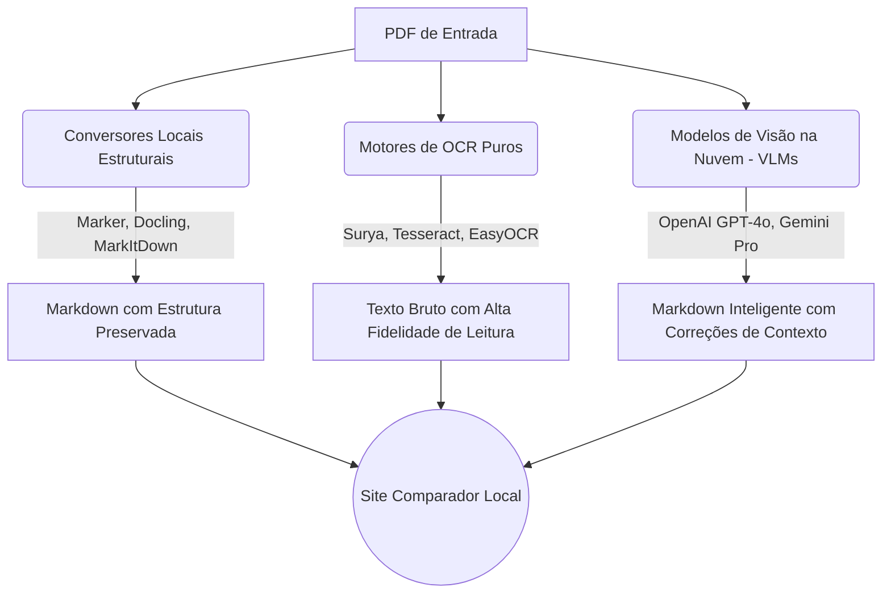

# Comparador Didático: PDF → Markdown & OCR

Bem-vindo ao observatório de **Extração de Texto e Estrutura**! 
Este repositório foi criado para aprender e comparar didaticamente como diferentes ferramentas de Inteligência Artificial e OCR interpretam e convertem arquivos PDF estruturados (com tabelas, títulos e formatações).

## 🛠 Arquitetura do Projeto

Aqui usamos uma abordagem separada para cada "família" de ferramentas:

## 🚀 Como reproduzir localmente?

1. Instale o Python e crie um ambiente virtual: `python3 -m venv venv` e então `source venv/bin/activate`
2. Instale as dependências: `pip install openai google-generativeai docling markitdown easyocr`
3. Execute o script `main_runner.py` (em breve) para iterar sobre todos os PDFs da pasta `input/`.
4. Abra o `docs/index.html` em seu navegador para comparar os resultados gerados de forma visual.
