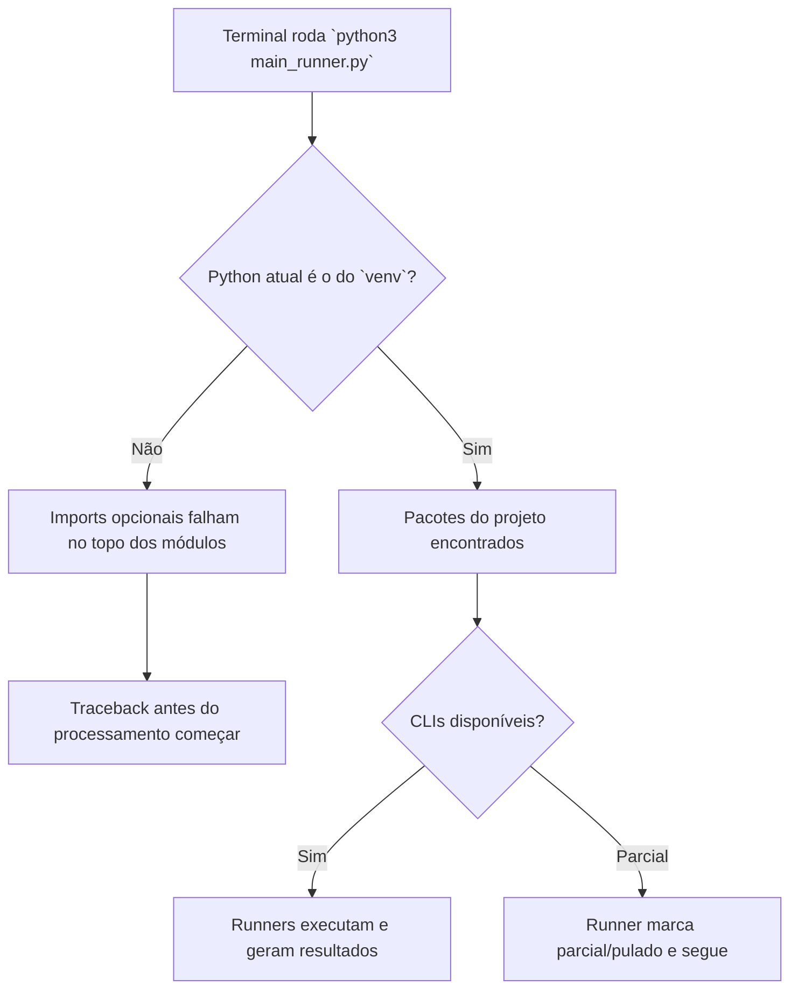

# Diagnóstico do Runner e Plano de Endurecimento

Data: 2026-03-13

## Resumo executivo

O traceback original não vinha de erro de sintaxe em `main_runner.py`. O problema principal era de **ambiente de execução**:

- `python3 main_runner.py` no terminal estava usando o **Python global**.
- O repositório já tinha um `venv/` com os pacotes necessários.
- No Python global faltavam `pdf2image`, `markitdown`, `easyocr`, `pytesseract` e `google-generativeai`.
- Havia um bug adicional em [run_mineru.py](../../src/run_mineru.py): o código chamava `magic-pdf`, mas o CLI instalado no `venv` expõe `mineru`.

## Atualização: incidente de memória na execução completa

Durante a execução completa com `run.sh`, o problema deixou de ser só ambiente. O gargalo passou a ser **memória e tempo de espera de rede**:

- [run_cloud_apis.py](../../src/run_cloud_apis.py) carregava todas as páginas do PDF de uma vez com `convert_from_path(...)`.
- [run_ocr_engines.py](../../src/run_ocr_engines.py) fazia o mesmo para Tesseract e EasyOCR.
- Em PDFs grandes, isso deixava várias imagens gigantes na RAM ao mesmo tempo.
- Quando Gemini/OpenAI demoravam a responder, o processo ficava parado segurando toda essa memória.

### Correção aplicada

1. `Cloud APIs` agora converte **uma página por vez** e libera a imagem logo após salvar/processar.
2. `OCR Engines` agora também converte **uma página por vez**.
3. Chamadas de Gemini/OpenAI agora usam timeout configurável por `API_TIMEOUT_SECONDS` para não travar indefinidamente.

### Efeito esperado

- Menor pico de RAM.
- Menor chance de o macOS mostrar alerta de memória esgotada.
- Se uma API travar, aquela página falha e o processo pode seguir.

## Evidências coletadas

### Python global (`python3`)

| Item | Status |
| --- | --- |
| `docling` | OK |
| `openai` | OK |
| `mineru` | MISSING |
| `pdf2image` | MISSING |
| `markitdown` | MISSING |
| `easyocr` | MISSING |
| `pytesseract` | MISSING |
| `google-generativeai` | MISSING |

### Python do projeto (`venv/bin/python`)

| Item | Status |
| --- | --- |
| `docling` | OK |
| `openai` | OK |
| `pdf2image` | OK |
| `markitdown` | OK |
| `easyocr` | OK |
| `pytesseract` | OK |
| `google-generativeai` | OK |
| `mineru` | OK |

### Ferramentas de linha de comando observadas

| CLI | Status |
| --- | --- |
| `marker_single` | disponível no PATH global |
| `surya_ocr` | disponível no PATH global |
| `tesseract` | disponível |
| `pdftoppm` | disponível |
| `mineru` | disponível após ativar o `venv` |
| `magic-pdf` | ausente |

### Variáveis de ambiente

| Variável | Status |
| --- | --- |
| `OPENAI_API_KEY` | presente |
| `GEMINI_API_KEY` | ausente |

## Visualização

## O que foi mudado nesta branch

1. Adicionado preflight de ambiente em [main_runner.py](../../main_runner.py) para mostrar:
   - interpretador atual
   - interpretador esperado do `venv`
   - pacotes Python
   - CLIs
   - variáveis de ambiente
2. Criado [src/environment_diagnostics.py](../../src/environment_diagnostics.py) para rodar o diagnóstico isoladamente.
3. Criado [src/run_result.py](../../src/run_result.py) para padronizar status `success`, `partial`, `skipped` e `failed`.
4. Todos os runners agora retornam status estruturado em vez de depender só de `print`.
5. [main_runner.py](../../main_runner.py) agora imprime resumo por PDF e consolidado no fim.
6. [src/run_mineru.py](../../src/run_mineru.py) foi corrigido para usar `mineru` e fazer fallback para o legado `magic-pdf`.
7. Adicionado [requirements.txt](../../requirements.txt) com as versões observadas no `venv` do projeto.
8. [run.sh](../../run.sh) agora mostra explicitamente qual `python3` está ativo.

## O que ainda depende do ambiente

- `marker_single` e `surya_ocr` continuam resolvidos pelo `PATH` do sistema.
- `GEMINI_API_KEY` ainda precisa ser carregada se o objetivo for executar a comparação com Gemini.
- O site de visualização em `docs/index.html` depende dos arquivos gerados em `docs/results/`.

## Retomada

- Branch de trabalho: `codex-runner-hardening-diagnostics`
- Commit descritivo planejado para esta etapa:
  `Harden runners, add preflight diagnostics, and document the environment gap`
- Comando recomendado para retomar:
  `git checkout codex-runner-hardening-diagnostics`
