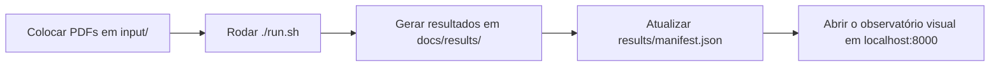

# Guia Prático do Projeto

## O que este projeto faz

Ele pega PDFs e compara como ferramentas diferentes leem o mesmo documento.

Temos 3 famílias principais:

- **Estruturais:** `marker`, `mineru`, `docling`, `markitdown`
- **OCR puro:** `surya`, `tesseract`, `easyocr`
- **Modelos de nuvem:** `openai`, `gemini`

## Fluxo simples



## O que sai em cada pasta

- `docs/results/marker/...`: markdown estruturado + imagens extraídas
- `docs/results/mineru/...`: markdown estruturado + figuras + artefatos extras
- `docs/results/docling/...`: markdown limpo
- `docs/results/markitdown/...`: markdown simples
- `docs/results/ocr_engines/...`: OCR bruto por motor
- `docs/results/cloud_apis/...`: markdown por página para Gemini/OpenAI

## Novo padrão para saídas paginadas

Quando uma ferramenta gera `page_0`, `page_1`, `page_2` etc., o projeto agora também monta um arquivo único:

- `document.md`

Exemplos:

- `docs/results/cloud_apis/006 - Insuficiência respiratória aguda/gemini/document.md`
- `docs/results/ocr_engines/28. Foreign Body in the Pediatric Airway/tesseract/document.md`

## Como rodar tudo

```bash
source ~/.secrets
./run.sh
```

## Como abrir a visualização

```bash
python3 scripts/build_manifest.py
./scripts/serve_docs.sh
```

Depois abra:

```text
http://localhost:8000
```

## Como testar um PDF fora deste projeto

### Marker

```bash
cd ~/projetos/PDF_markdown_OCR_comparison
source venv/bin/activate
python3 scripts/run_one.py \
  --tool marker \
  --input ~/Downloads/meu-pdf.pdf \
  --output ~/Desktop/pdf-tests
```

### MinerU

```bash
cd ~/projetos/PDF_markdown_OCR_comparison
source venv/bin/activate
python3 scripts/run_one.py \
  --tool mineru \
  --input ~/Downloads/meu-pdf.pdf \
  --output ~/Desktop/pdf-tests
```

### Rodar vários de uma vez

```bash
cd ~/projetos/PDF_markdown_OCR_comparison
source venv/bin/activate
python3 scripts/run_one.py \
  --tool marker \
  --tool mineru \
  --tool docling \
  --input ~/Downloads/meu-pdf.pdf \
  --output ~/Desktop/pdf-tests
```

## Aliases sugeridos

Se fizer sentido para o seu uso diário:

```bash
alias pdfobs='cd ~/projetos/PDF_markdown_OCR_comparison'
alias pdfrun='cd ~/projetos/PDF_markdown_OCR_comparison && ./run.sh'
alias pdfview='cd ~/projetos/PDF_markdown_OCR_comparison && ./scripts/serve_docs.sh'
alias pdfone='cd ~/projetos/PDF_markdown_OCR_comparison && source venv/bin/activate && python3 scripts/run_one.py'
```

## Quando usar cada ferramenta

- **Marker:** melhor equilíbrio entre estrutura, tabelas e figuras
- **MinerU:** muito forte quando há figuras e layout mais complexo
- **Docling:** muito bom para markdown puro, mais limpo
- **MarkItDown:** útil como baseline leve, mas depende do extra de PDF instalado
- **Surya/Tesseract/EasyOCR:** bons para OCR cru, menos bons para layout final
- **OpenAI/Gemini:** úteis para comparar interpretação visual por página

## Problemas comuns

### `markitdown` não gera nada

Provável causa: instalado sem suporte a PDF.

Correção:

```bash
source venv/bin/activate
pip install "markitdown[pdf]==0.1.5"
```

### `surya` não gera saída

O CLI mudou de versão. Este projeto agora usa o formato correto para a versão atual:

```bash
surya_ocr arquivo.pdf --output_dir ./saida
```

## Arquivos importantes

- `main_runner.py`: roda tudo
- `scripts/run_one.py`: roda um PDF qualquer com ferramentas escolhidas
- `scripts/serve_docs.sh`: abre a visualização local
- `docs/results/manifest.json`: mapa real do que foi gerado
- `docs/index.html`: observatório visual
